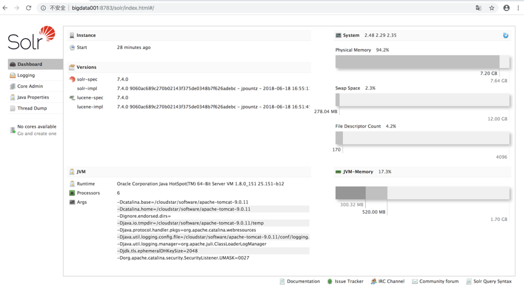

一、下载，解压，
wget http://mirrors.tuna.tsinghua.edu.cn/apache/lucene/solr/7.4.0/solr-7.4.0.tgz

tar -xzvf  solr-7.4.0.tgz

二、把solr部署到tomcat下


1.复制webapp
cp -r /cloudstar/software/solr-7.4.0/server/solr-webapp/webapp   $TOMCAT_HOME/webapps/solr

2.添加相应的资源
cd /cloudstar/software/solr-7.4.0/server/lib/ext/
cp * $TOMCAT_HOME/webapps/solr/WEB-INF/lib/


cd /cloudstar/software/solr-7.4.0/server/lib/
cp metrics* $TOMCAT_HOME/webapps/solr/WEB-INF/lib/


cd /cloudstar/software/solr-7.4.0/server/resources/
mkdir $TOMCAT_HOME/webapps/solr/WEB-INF/classes/
cp log4j2.xml $TOMCAT_HOME/webapps/solr/WEB-INF/classes/


3.创建solr home

cd /cloudstar/software/solr-7.4.0/server/
cp -r solr /cloudstar/software/solrhome


4关联solr及solrhome,需要修改tomcat里solr工程的web.xml文件

cd $TOMCAT_HOME/webapps/solr/WEB-INF
vim web.xml
```
修改前
  <!--
    <env-entry>
       <env-entry-name>solr/home</env-entry-name>
       <env-entry-value>/put/your/solr/home/here</env-entry-value>
       <env-entry-type>java.lang.String</env-entry-type>
    </env-entry>
   -->
修改后
  <env-entry>
       <env-entry-name>solr/home</env-entry-name>
       <env-entry-value>/cloudstar/software/solrhome</env-entry-value>
       <env-entry-type>java.lang.String</env-entry-type>
    </env-entry>
   
   
   
   
   
   并注释掉最后的部分
   
   <!--
    <security-constraint>
       <web-resource-collection>
         <web-resource-name>Disable TRACE</web-resource-name>
         <url-pattern>/</url-pattern>
         <http-method>TRACE</http-method>
       </web-resource-collection>
       <auth-constraint/>
     </security-constraint>
     <security-constraint>
       <web-resource-collection>
         <web-resource-name>Enable everything but TRACE</web-resource-name>
         <url-pattern>/</url-pattern>
         <http-method-omission>TRACE</http-method-omission>
       </web-resource-collection>
     </security-constraint>
   -->
   
```


三、重启Tomcat验证部署成功

    关闭命令：
        $TOMCAT_HOME/bin/shutdown.sh
    启动命令：
        $TOMCAT_HOME/bin/startup.sh
        
    浏览器：
        http://bigdata001:8783/solr/index.html
        
   
     