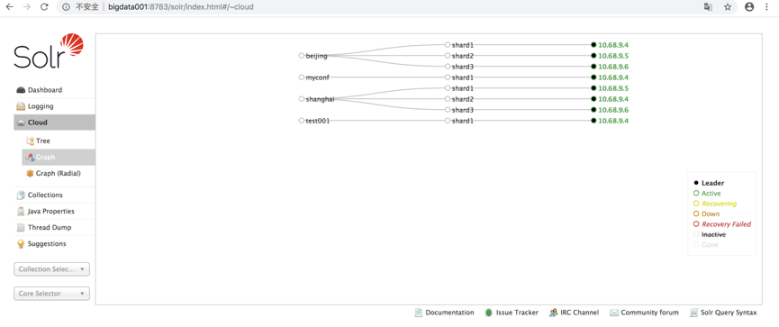

参考链接
http://www.cnblogs.com/dijia478/p/8124751.html

一、solrcloud需要依赖zookeeper,在此之前请先部署zookeeper

二、部署solrcloud

1.复制软件
scp -r solrhome bigdata002:/cloudstar/software/
scp -r solrhome bigdata003:/cloudstar/software/

scp -r apache-tomcat-9.0.11 bigdata002:/cloudstar/software/
scp -r apache-tomcat-9.0.11 bigdata003:/cloudstar/software/

2.上传配置到zookeeper

a.修改tomcat启动项(主节点上的配置)
    vim $TOMCAT_HOME/bin/catalina.sh
    在最上面添加如下代码：
    JAVA_OPTS="-Djetty.port=8783 -Dbootstrap_confdir=/cloudstar/software/solrhome/configsets/sample_techproducts_configs/conf -Dcollection.configName=solrcloud -DzkHost=bigdata002:2181,bigdata003:2181 -Dsolr.solr.home=/cloudstar/software/solrhome/"
    说明：
    -Djetty.port：配置solr使用的端口，默认为 8983，这里我们使用的是tomcat,端口为 8783
    -DzkHost: 配置 zookeeper 集群地址，多个地址逗号分隔
    -Dbootstrap_confdir 上传配置文件的目录
    -Dcollection.configName  配置文件的名称
    -Dsolr.solr.home  配置solrhome（solr home 的配置方式有几种不同方式）

b.修改tomcat启动项(从节点上的配置)
    vim $TOMCAT_HOME/bin/catalina.sh
    在最上面添加如下代码：
    JAVA_OPTS="-Djetty.port=8783  -Dcollection.configName=solrcloud -DzkHost=bigdata002:2181,bigdata003:2181 -Dsolr.solr.home=/cloudstar/software/solrhome/"

三、重启Tomcat验证部署成功

    关闭命令：
        $TOMCAT_HOME/bin/shutdown.sh
    启动命令：
        $TOMCAT_HOME/bin/startup.sh
        
    浏览器：
        http://bigdata001:8783/solr/index.html
   

