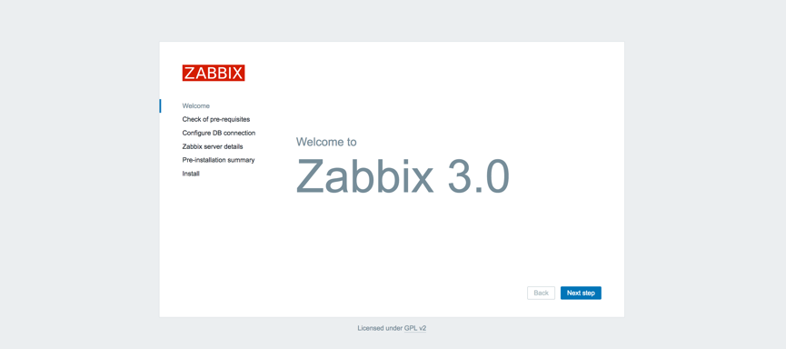
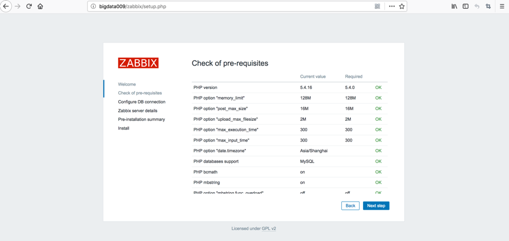
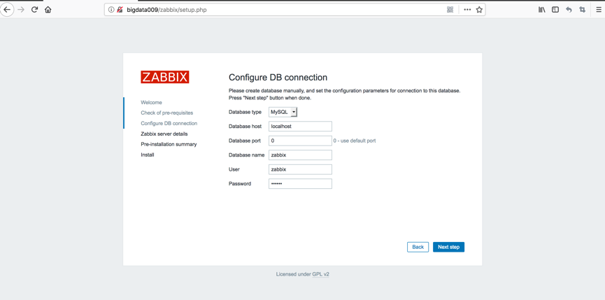
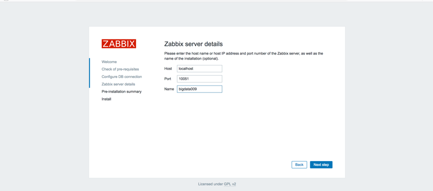
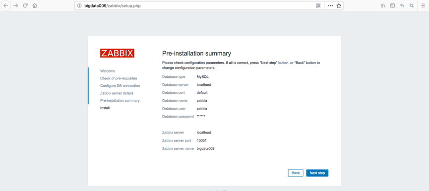
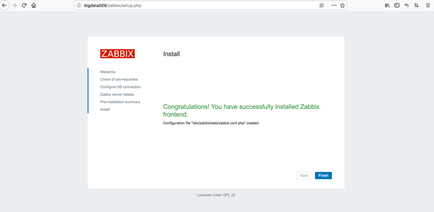
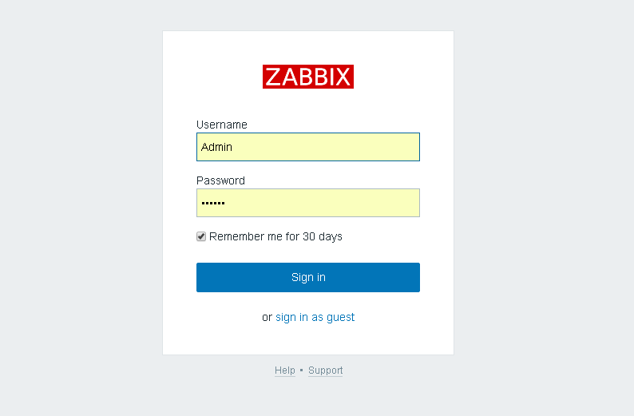
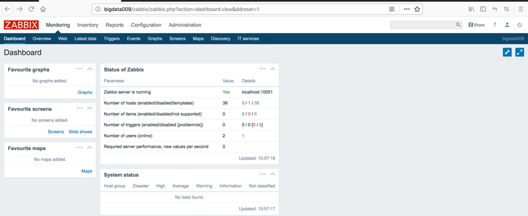
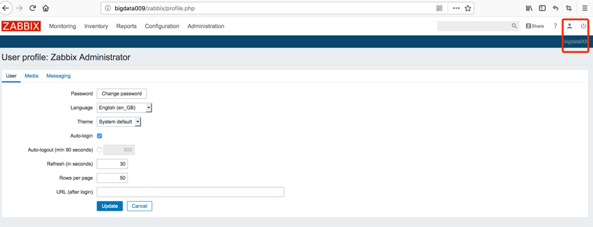

参考链接：
https://www.cnblogs.com/xiewenming/p/7732144.html


一，关闭selinux和iptables
```
systemctl stop firewalld.service
setenforce 0
```


二，安装Zabbix rpm包仓库
```
rpm -vhi http://repo.zabbix.com/zabbix/3.0/rhel/7/x86_64/zabbix-release-3.0-1.el7.noarch.rpm
```


三，安装zabbix-server-mysql和zabbix-web-mysql
```
yum install -y zabbix-server-mysql zabbix-web-mysql zabbix-get  zabbix-proxy-mysql  zabbix-agent 
```


四，安装并且启动mysql5.6及初始化数据库信息
```
rpm -ivh http://repo.mysql.com/yum/mysql-5.6-community/el/6/x86_64/mysql-community-release-el6-5.noarch.rpm 
yum install -y mysql-community-server 
systemctl start mysqld
/sbin/chkconfig mysqld on 
mysql_secure_installation 
```

这步骤后面有设置密码的动作
现在的密码是：root/12345678


五，创建zabbix数据库，创建zabbix账号


```
mysql -uroot -p
 
 
mysql> create database zabbix character set utf8 collate utf8_bin;
Query OK, 1 row affected (0.00 sec)

mysql> grant all privileges on zabbix.* to 'zabbix'@'localhost' identified by 'zabbix';
Query OK, 0 rows affected (0.00 sec)

mysql> flush privileges;
Query OK, 0 rows affected (0.00 sec)
``


mysql -uroot -p12345678 -e "create database zabbix default character set utf8 collate utf8_bin;"


mysql -uroot -p12345678 -e "grant all on zabbix.* to 'zabbix'@'%' identified by 'zabbix';"`


六，导入默认的zabbix数据库信息
```zcat /usr/share/doc/zabbix-server-mysql-3.0.20/create.sql.gz | mysql zabbix -uzabbix -pzabbix
```
/usr/share/doc/


七，修改zabbix_server.conf的配置文件

[root@linux-node2 ~]# grep ^DB /etc/zabbix/zabbix_server.conf
DBHost=localhost
DBName=zabbix
DBUser=zabbix
DBPassword=zabbix

八，修改配置文件/etc/httpd/conf.d/zabbix.conf，时区改成 Asia/Shanghai

php_value max_execution_time 300 
php_value memory_limit 128M 
php_value post_max_size 16M 
php_value upload_max_filesize 2M 
php_value max_input_time 300 
php_value always_populate_raw_post_data -1 
php_value date.timezone Asia/Shanghai


九，启动apache/zabbix-server服务并设置为开机启动

systemctl start httpd
systemctl enable httpd
netstat -an |grep 80

systemctl start zabbix-server
systemctl enable zabbix-server


1、查看zabbix-server日志

tailf  /var/log/zabbix/zabbix_server.log

2.zabbix-server的web目录
ls /usr/share/zabbix


十，访问网站，例如：http://本机IP/zabbix，如下图所示
http://bigdata009/zabbix



十一，选择下一步，Check of pre-requisites,如图所示：



十二，选择下一步，配置zabbix server detail，如下图所示：

十三，选择下一步，配置zabbix server detail，如下图所示：



十四：点击下一步，便完成安装，安装完成的界面如下图所示：


十五，安装完成，如下图所示：



```
根据提示可以看到上面图形界面的操作都写到一个配置文件中

复制代码
[root@linux-node1 zabbix]# more /etc/zabbix/web/zabbix.conf.php 
<?php
// Zabbix GUI configuration file.
global $DB;

$DB['TYPE']     = 'MYSQL';
$DB['SERVER']   = 'localhost';
$DB['PORT']     = '0';
$DB['DATABASE'] = 'zabbix';
$DB['USER']     = 'zabbix';
$DB['PASSWORD'] = '123456';

// Schema name. Used for IBM DB2 and PostgreSQL.
$DB['SCHEMA'] = '';

$ZBX_SERVER      = 'localhost';
$ZBX_SERVER_PORT = '10051';
$ZBX_SERVER_NAME = 'zabbix 3.0.12';

$IMAGE_FORMAT_DEFAULT = IMAGE_FORMAT_PNG;
复制代码
```


 十六：Zabbix·server的默认账号Admin 密码zabbix，如图所示：
 
 
 
 十七，默认登陆首页，如下图所示：

 

十八，移除或改名web目录下面的setup.php文件
```
cd /usr/share/zabbix
mv setup.php setup.php.bak
```
十九，更改web登陆的Admin默认密码
 

二十，设置新的密码，这里也可以设置界面的主题、语言和登陆后显示的默认界面等

至此安装部分结束

附 官方英文版文档

https://www.zabbix.com/documentation/3.0/manual/installation


----------------------------------------------------
在bigdata001上配置agent


一、配置yum源

vim /etc/yum.repos.d/zabbix.repo

[zabbix]
name=zabbix
baseurl=http://repo.zabbix.com/zabbix/3.2/rhel/7/x86_64/
gpgcheck=0
enable=1

cat /etc/yum.repos.d/zabbix.repo

二、安装agent
yum install -y zabbix-agent zabbix-sender


三、配置agent
vim /etc/zabbix/zabbix_agentd.conf

server=10.68.9.2
serverActive=10.68.9.2
hostname=bigdata001

四、启动zabbix
service zabbix-agent stop
service zabbix-agent start

五、服务端测试 （在bigdata009上测试）
zabbix_get -s bigdata001 -k system.cpu.switches


教程链接

http://www.zsythink.net/archives/tag/zabbix/page/2/