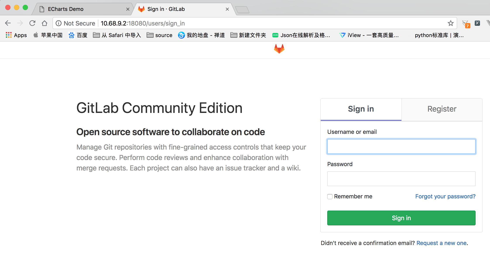

## Gitlab 安装文档
使用yum命令安装gitlab
```
sudo yum install gitlab-ce
```
使用``sudo vim /etc/gitlab/gitlab.rb``命令修改gitlab默认配置，修改以下两个有冲突的端口。

```
# nginx  监听端口默认80
nginx['listen_port'] = 18080
# unicorn 默认端口 8080
unicorn['port'] = 8087
```
执行　``gitlab-ctl reconfigure``命令使配置生效。

执行 ``gitlab-ctl restart``命令，启动gitlab。

访问 http://10.68.9.2:18080/ 设置root初始密码。安装完成。


