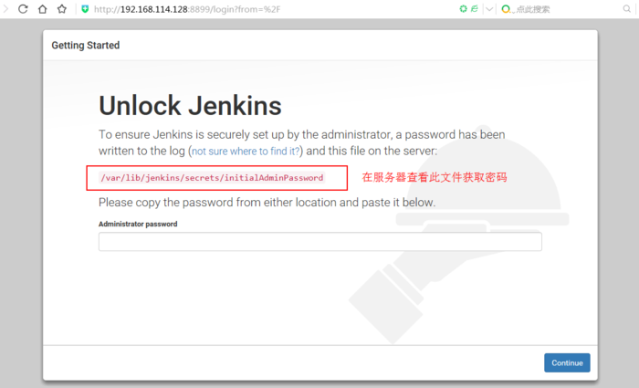
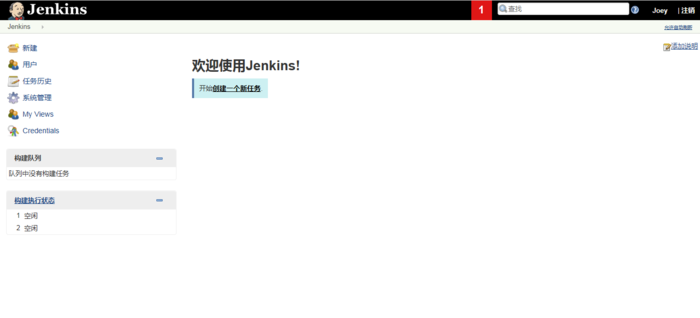

## Jenkins安装文档
### 安装步骤：
```
#下载依赖
sudo wget -O /etc/yum.repos.d/jenkins.repo https://pkg.jenkins.io/redhat-stable/jenkins.repo
#导入秘钥
sudo rpm --import https://pkg.jenkins.io/redhat-stable/jenkins.io.key
#安装Jenkins
yum -y install jenkins
```
使用``vim /etc/sysconfig/jenkins``命令，修改Jenkins配置文件，按需修改Jenkins端口号。
```
JENKINS_PORT="8080"
```
### 启动Jenkins服务
```
systemctl restart jenkins
```
访问http://10.68.9.2:8080/，出现以下页面:

在服务器端执行以下命令获取Jenkins初始密码。
```
cat /var/lib/jenkins/secrets/initialAdminPassword
```
然后将密码填入文本框，并点击continue，按需选择并安装插件。
插件安装完成后访问http://10.68.9.2:8080/，显示以下页面，安装完成。


