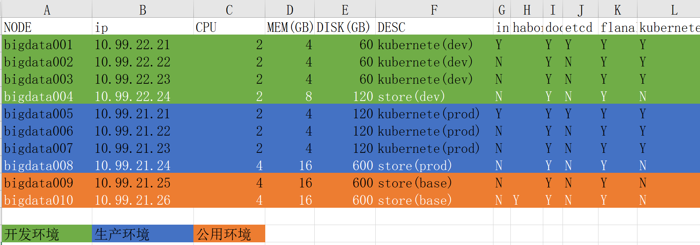

## 机器列表和集群规划

！！！规划图

## 探索历程
```
1.后端演进：原生jar—>原生docker—>docker-compose—>mesos—>k8s
2.前端演进：原生应用—>webpack打包+Nginx—>原生docker—>docker-compose—>mesos—>k8s     
```
##服务整体规划

```
1.总体分为面向三个群体进行服务，developers,operaters,clients

2.developer团队采用敏捷模式，可以异地办公。
3.operater主要分为三层
  a.控制层：对整个运维流程做流程控制
          gitlab代码中心：用于对开发团队的代码，资料，进行管理。
                          为了对代码质量进行管控，使用sonar进行代码静态扫描
                          为了对代码质量进行管控，使用upsource进行代码review
          Jenkins控制中心：利用Jenkins的不同project对gitevent的监听，来控制整个运维的流程。
                          编译： 
                                  编译前端必须有node和npm环境
                                  编译后端必须有java，maven环境
                          打包：
                                  必须有docker环境
                          推送镜像：
                                   必须能连通docker-register或habor
                          部署镜像：
                                   要么使用ssh远程操作的命令进行调用k8s的cli
                                   要么Jenkins编译节点必须有k8s的cli
          habor镜像中心：
                          用于对管理docker的image，磁盘容量要大，可以考虑使用ceph等分布式存储系统
          kubernetes管理中心： 
                          用于管理所有的docker镜像，和运行的服务               
  b.计算层：微服务真正的运行环境，对外提供服务
          k8s外部：主要是宣传和导流的静态页面
              aws
          k8s内部:整个k8s集群
              前端：不通的项目有不同的portal
                  marketing-portal:用户洞察平台
                  apistore-portal:数据合作平台
              后端： 
                  通用性服务：
                          eureka-service：微服务的注册中心，维护整个spring-cloud微服务的entrypoint。[pod,container,service的entrypoint]，可以形成集群，地址固定
                          config-service：微服务的配置中心, 维护整个spring-cloud微服务的最灵活配置，配合rabbitMQ可以实现微服务配置的热更新，可以形成集群，地址随机调度，注册到eureka-service
                          gateway-service:微服务的网关中心，维护整个spring-cloud微服务的网关信息，对服务进行转发和过滤，可以形成集群，地址固定
                          zipkin-service：微服务的追踪中心，维护整个spring-cloud微服务的服务调用关系，跟踪每一次调用的流程信息，不能形成集群，地址固定
                          monitor-service:微服务的监控中心，用于监控整个pring-cloud微服务的运行状态，不能形成集群，地址固定
                  业务性服务：
                          authoer-service:用于对不同微服务进行验证和授权，service集群由k8s管理
                          apistore-service:用于和电信进行进行交互，service集群由k8s管理
                          xpay-service:用于多种充值业务，支付宝，银联，微信支付等
                          xfs-service:用于对外提供文件读写服务,可以支持local，nfs,hdfs,ceph等
                          shell-executer:用于远端执行shell命令，【现阶段用于，控制异地节点的大数据应用，后续可以被其他服务依赖】
                  公用性代码：
                          common：是所有spring-cloud微服务的工具性代码（StringUtils,DateUtils等）
                  
  c.数据层：存储是整个微服务的状态信息
           mysql:用于存储账户信息，电信数据解析后的信息等各种业务信息
           redis：用于提供数据缓存，加速响应速度
           nfs：用于存储用户上传的协议文件等（后续可以考虑使用ceph等分布式文件系统替换）
           电信数据源：
           联通数据源：
           移动数据源：
           银联数据源：
           其他数据源：
           
```


##gitlab项目规划

```
gitlab中把项目分开
1.前端project
2.后端project
3.配置project
4.文档管理project
```
##gitlab前端项目规划

```
前端project中区分相关module，每个module是完整的Vue工程，
通过package.json来管理前端依赖项。
1.合作module
2.营销module
3.宣传module
4.管理module
5.deployment中放置前端项目Dockerfile模板
9.sonar-project.properties如果使用sonar进行代码检查需要配置
10.build_push_deploy_jenkins_k8s_402.sh是Jenkins调用的入口脚本
```
##webstorm规划


##gitlab后端项目规划

```
后端project中区分相关module，每个module是完整的maven工程，可以允许的springboot工程。
通过父子maven工程来管理通用的依赖项。
1.验证相关module
2.路由相关module
3.eureka注册中心module
4.config-server配置中心module
5.zipkin追踪中心module
6.monitor监控中心module
7.x-pay支付微服务
8.x-file文件微服务
9.deployment中放置后端项目Dockerfile模板
10.sonar-project.properties如果使用sonar进行代码检查需要配置
11.build_push_deploy_jenkins_k8s_402.sh是Jenkins调用的入口脚本
12.common中放置多个业务module中使用的工具方法和工具类库，不需要时springboot的工程
```


## kubernetes和spring-cloud结合技巧
```
系统特点： 
    个性和共性要统一,个性的东西可以出现多次，共性的事物只出现一次。
    一、有继承和覆盖特性事物的统一方案（差异化）
        利用事物的继承和覆盖特性，共性的事物在project级别，个性的事物在module级别。
        1.依赖关系的个性和共性：
          利用maven的继承和依赖关系，共性依赖配置到project级别，个性依赖配置到module级别，实现依赖关系个性和共性的统一
          
        2.代码的个性和共性
          利用maven提供的依赖机制，个性的代码编写到各种的module，共性的代码编写到common-module，实现代码个性和共性的统一
          
        3.配置的个性和共性
          利用spring-cloud的配置继承和覆盖关系，共性配置存储到project级别，个性配置存储到module级别，并根据不同的env去适配不同的环境
    二、无继承和覆盖特性的事物的统一方案（模板化）
        利用模板来承载共性的事物，利用脚本来生成个性的事物
        1.docker的个性和共性
          将公共的Dockerfile抽取成模板，利用脚本生成各个module的Dockerfile
          
        2.k8s的个性和共性
          将公共的k8s部署文件抽取成模板，利用脚本生成各个module的k8s部署文件
          
        3.部署脚本的个性和共性
          公共脚本可以只有一套，通过不同的条件，运行不同的分支，来实现共性和个性的统一。  
          
```


```
1.网络方案的问题？
  采用flannel网络，扁平化整个大的虚拟网络，所有容器的IP之间应该能够相互访问
2.监控问题？
  可以采用kube-let内置的cadvisor+influxDB+grafna来实现对k8s集群的监控，收集和展现
3.日志问题？
  可以采用elk的方案对k8s集群的日志进行收集，存储和分析。 
4.ingress问题？
  只有前端在大流量下才需要ingress，生产当中没有使用，自己测试了一下可以通过。直接使用Nginx就可以。
  
5.存储的问题？
  尽量采用PV和PVC的方式为k8s挂载各种存储方案，我们目前采用了nfs的方案。
      
      存储策略
          ReadWriteOnce：是最基本的方式，可读可写，但只支持被单个Pod挂载。
          ReadOnlyMany：可以以只读的方式被多个Pod挂载。
          ReadWriteMany：这种存储可以以读写的方式被多个Pod共享。不是每一种存储都支
      存储类别：（见知识部分）
            
6.模板化的问题：尽量简单化：
     1.所有前端后端module采用统一的规范
     2.maven依赖配置，Dockerfile模板，k8s模板，都是为了统一化共性的东西，简单化
     3.控制脚本名称统一，调用格式统一
     
7.配置应该放到哪里的问题
     a.configMap:必须在service启动以前存在，并不能热更新
       比较适合服务启动时的较为固定的配置，可以通过DownWard进行注入
     b.k8s部署模板的env字段中：可以通过脚本生成个性化的替换值
       比较适合服务启动时根据环境而变化的配置
     c.springboot中的yaml文件：尽量不配置在这里，这里和代码耦合度太强，只能通过重新编译源代码来改变
       比较适合启动服务，必须链接config-service的信息。本来不想配置到这里，但是，启动服务必须的东西还是要有的。
     d.gitLab中：尽量把所有的配置，放到git中，
       一方面可以利用gitLab做版本控制，另一方面可以配合rabbitMq可以实现服务配置的热更新
         


       8.蓝绿部署，滚动升级，版本回退的问题？
            这部分的概念成分比较大，技术难度不大，先阶段没有用到？


8.git使用的问题？  
    1.用git的版本来控制代码的版本
    2.git的分支来控制代码的预期环境 
    3.用git的分支触发Jenkins不同的项目，dev的push event 和master的merge event
9.Jenkins的问题？

4.Jenkins的不同项目会触发相应的脚本，进而对项目进行编译，打包，image，push image，k8s部署
5.部署脚本可以只有一套，不同环境可以对调用参数进行判断，进而定制个性的部分
```

```

后续提升点


存储


           
           1.common统一为一个module，提高复用率，减少代码重复
           2.利用git和configure server外化配置，并提供module级别细粒度控制.
           3.利用rabbiMQ和configuresever实现配置热更新，并通过git push event 事件，ii自动更新
           采用zipkin和springboot admin进行服务跟踪和监控
           
           4.采用sonar进行自动化测试
           
           5.开发端控制运维层次的流程
           
           采用docker和k8s的方案对服务进行部署
           
           
        
           

           
           运维工作 开发化、重代码，轻Jenkins
           
           kongzhi.bianhua
           配置的作用域和优先级
           
           共性个性 统一分布。多元一元
           
           
           前端打包时动态指定后端入口
           2.存储使用k8s的pvc pv 挂载nfsooooooì、啦
           
           
           2.git
           
           
           
           1.分合思想
           2.边界思想。前端负载和gateway负载
           4.两端钉死图
           
           不足之处
           
           
           
           
        
           hystrix
           linquesql
           公共服务抽取
           公共代码抽取
           代码质量提升
           异构系统集成
           前端工程化，服务端渲染 
           node 层加入
        

```