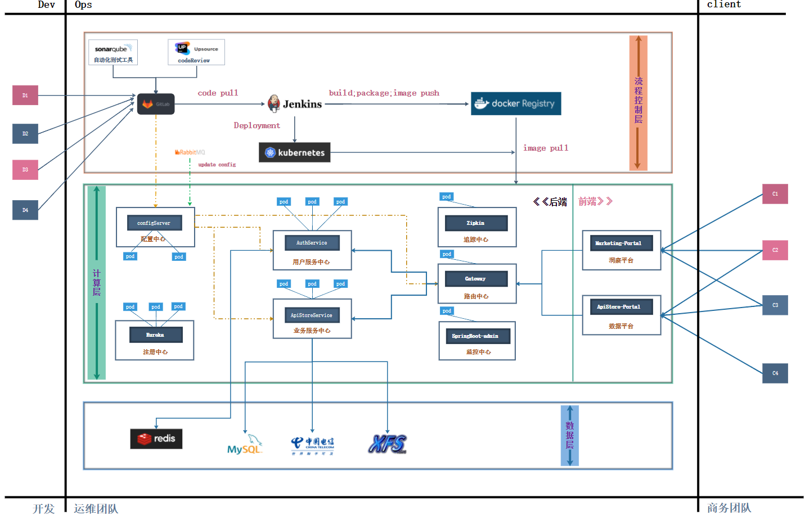
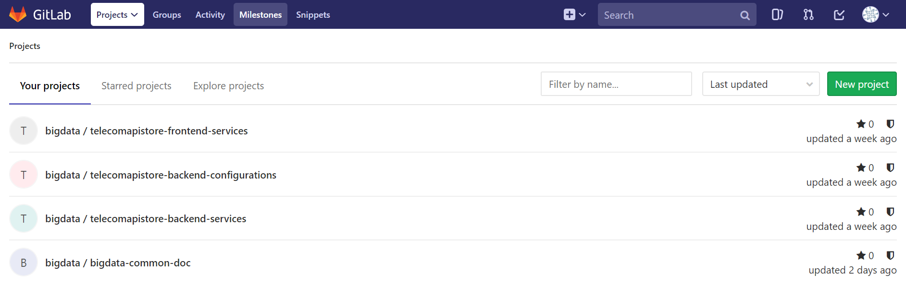
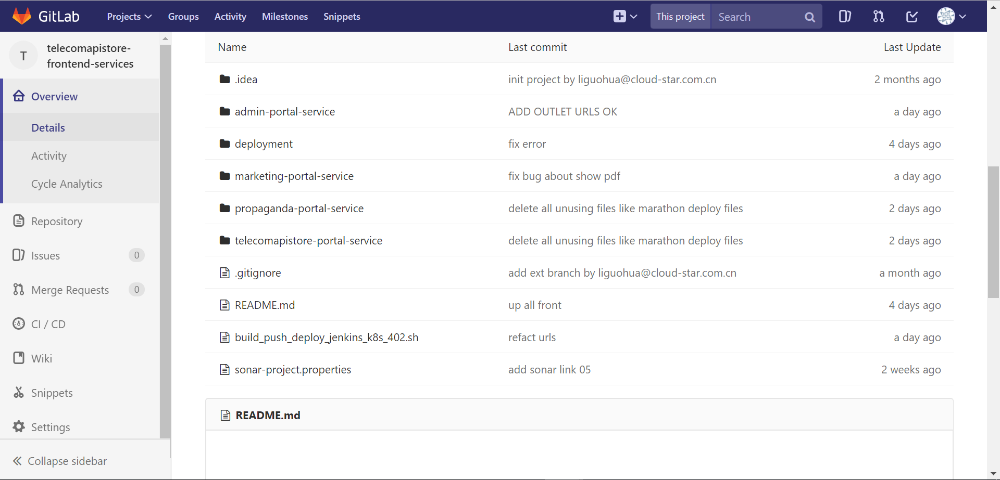
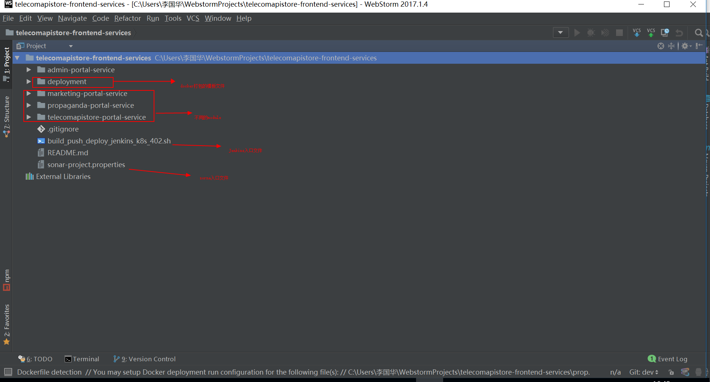
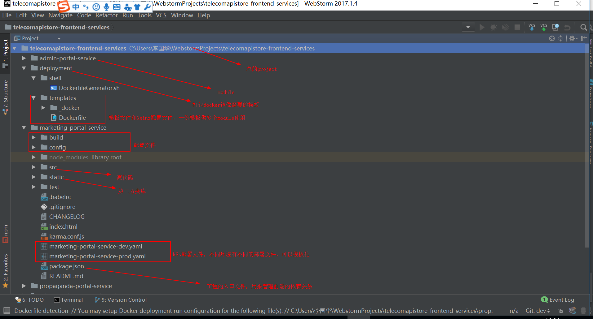
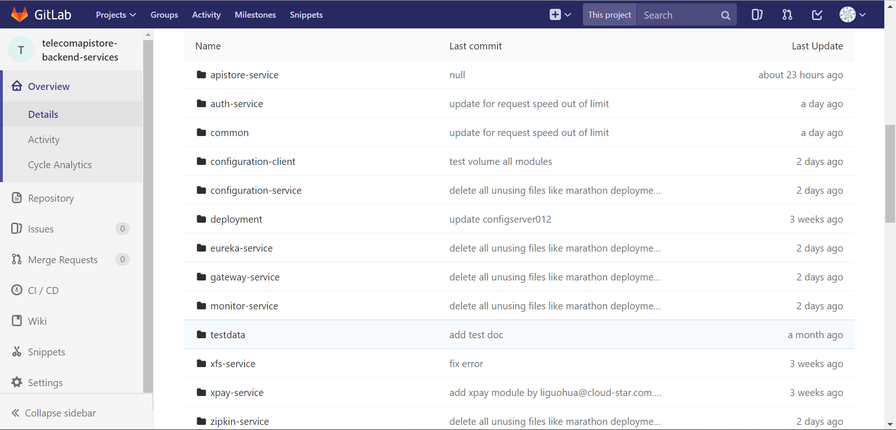

##gitlab项目规划

```
1.总体分为面向三个群体进行服务，developers,operaters,clients

2.developer团队采用敏捷模式，可以异地办公。
3.operater主要分为三层
  a.控制层：对整个运维流程做流程控制
          gitlab代码中心：用于对开发团队的代码，资料，进行管理。
                          为了对代码质量进行管控，使用sonar进行代码静态扫描
                          为了对代码质量进行管控，使用upsource进行代码review
          Jenkins控制中心：利用Jenkins的不同project对gitevent的监听，来控制整个运维的流程。
                          编译： 
                                  编译前端必须有node和npm环境
                                  编译后端必须有java，maven环境
                          打包：
                                  必须有docker环境
                          推送镜像：
                                   必须能连通docker-register或habor
                          部署镜像：
                                   要么使用ssh远程操作的命令进行调用k8s的cli
                                   要么Jenkins编译节点必须有k8s的cli
          habor镜像中心：
                          用于对管理docker的image，磁盘容量要大，可以考虑使用ceph等分布式存储系统
          kubernetes管理中心： 
                          用于管理所有的docker镜像，和运行的服务               
  b.计算层：微服务真正的运行环境，对外提供服务
          k8s外部：主要是宣传和导流的静态页面
              aws
          k8s内部:整个k8s集群
              前端：不通的项目有不同的portal
                  marketing-portal:用户洞察平台
                  apistore-portal:数据合作平台
              后端： 
                  通用服务：
                          eureka-service：微服务的注册中心，维护整个spring-cloud微服务的entrypoint。[pod,container,service的entrypoint]，可以形成集群，地址固定
                          config-service：微服务的配置中心,维护整个spring-cloud微服务的最灵活配置，配合rabbitMQ可以实现微服务配置的热更新，可以形成集群，地址随机调度，注册到eureka-service
                          
         
                  核心业务：
  c.数据层：

```

##gitlab项目规划

```
gitlab中把项目分开
1.前端project
2.后端project
3.配置project
4.文档管理project
```
##gitlab前端项目规划

```
前端project中区分相关module，每个module是完整的Vue工程，
通过package.json来管理前端依赖项。
1.合作module
2.营销module
3.宣传module
4.管理module
5.deployment中放置前端项目Dockerfile模板
9.sonar-project.properties如果使用sonar进行代码检查需要配置
10.build_push_deploy_jenkins_k8s_402.sh是Jenkins调用的入口脚本
```
##webstorm规划




##gitlab后端项目规划

```
后端project中区分相关module，每个module是完整的maven工程，可以允许的springboot工程。
通过父子maven工程来管理通用的依赖项。
1.验证相关module
2.路由相关module
3.eureka注册中心module
4.config-server配置中心module
5.zipkin追踪中心module
6.monitor监控中心module
7.x-pay支付微服务
8.x-file文件微服务
9.deployment中放置后端项目Dockerfile模板
10.sonar-project.properties如果使用sonar进行代码检查需要配置
11.build_push_deploy_jenkins_k8s_402.sh是Jenkins调用的入口脚本
12.common中放置多个业务module中使用的工具方法和工具类库，不需要时springboot的工程
```


```
1.用git的版本来控制代码的版本
2.git的分支来控制代码的预期环境 
3.用git的分支触发Jenkins不同的项目
4.Jenkins的不同项目会触发相应的脚本，进而对项目进行编译，打包，image，push image，k8s部署
5.部署脚本可以只有一套，不同环境可以对调用参数进行判断，进而定制个性的部分
```